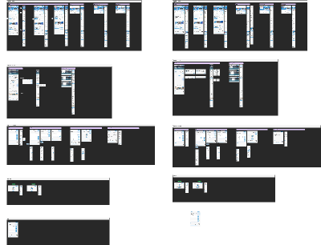
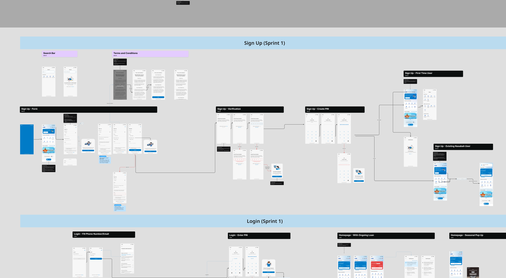
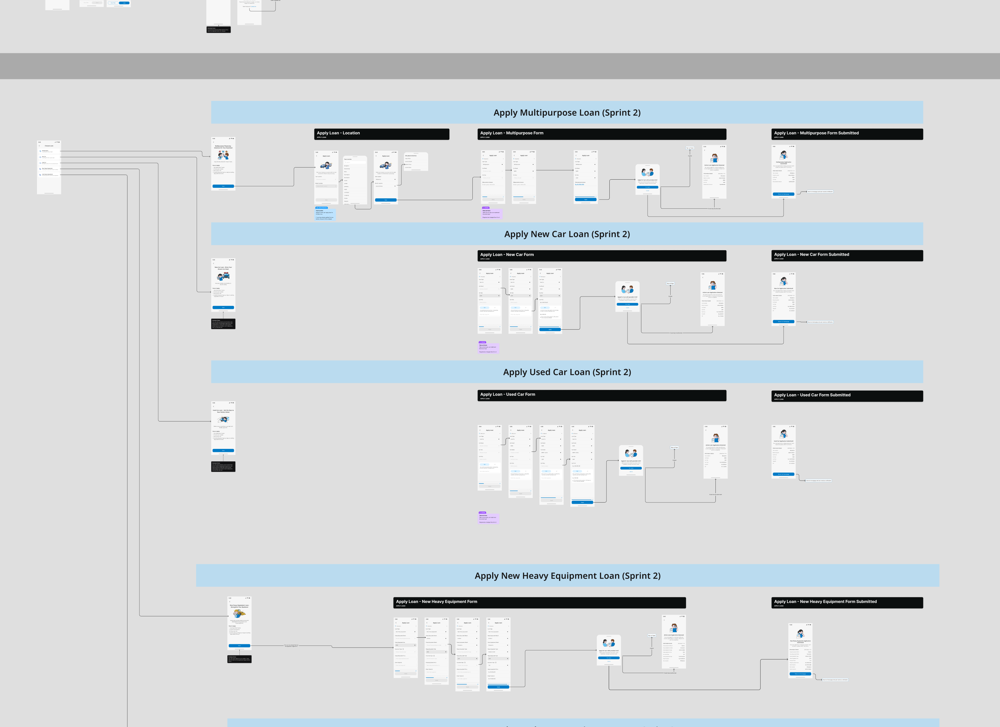
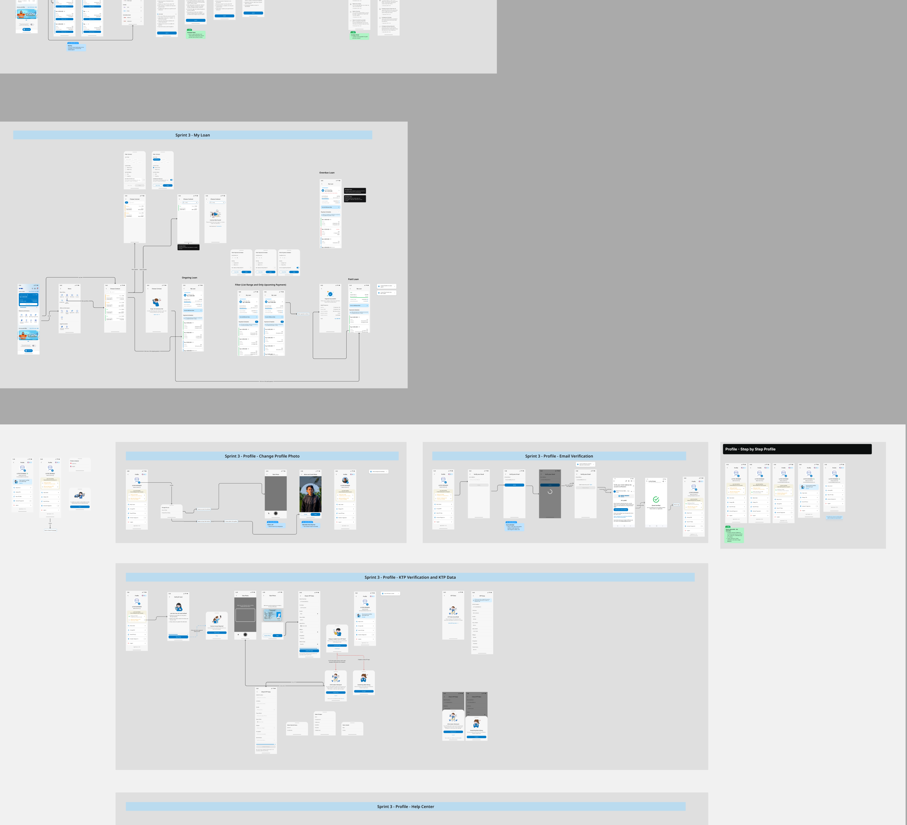

# Woori Finance Digital Experience

**Product strategy and UX leadership for a financial-services platform**

[LinkedIn](https://www.linkedin.com/in/intan-nilaputri/)

## Overview

This case study presents selected product and UX design work created for PT Woori Finance Indonesia. The design workspace covers connected digital-product journeys across mobile and web experiences, with flows, interface concepts, and supporting design exploration organised in Figma.

## My role

**Product Lead and Digital Development & Strategy Lead — PT Woori Finance Indonesia**

My work connected product direction, user experience, and delivery. I led digital-development initiatives and managed a team that included UI/UX specialists and researchers, helping translate customer and business needs into clearer product journeys and actionable delivery priorities.

Key areas of contribution included:

- Defining product direction and prioritising digital initiatives.
- Leading UI/UX and research collaboration across the product lifecycle.
- Reviewing user journeys, interaction flows, and interface concepts.
- Connecting customer needs with business and operational requirements.
- Coordinating product decisions across design, engineering, and business stakeholders.
- Driving improvements to the usability and consistency of digital products and services.

## Design focus

The attached Figma workspace shows a broad system of screens and flows rather than a single isolated interface. The portfolio presentation highlights:

- Mobile and web journey exploration.
- End-to-end task and navigation flows.
- Iterative screen and state design.
- Responsive product thinking across form factors.
- Design organisation for cross-functional review and delivery.

## Selected UI flows

The views below are curated sections of the original Figma workspace. They show enough of the interface system and journey structure to explain the work while avoiding publication of every working screen.

### Account access journeys

Selected sign-up and login flows, including form, verification, PIN creation, and account-entry states.

### Finance application journeys

Application paths for multipurpose, new-car, used-car, and heavy-equipment finance, showing the relationship between entry points, forms, validation, and submission outcomes.

### Loan and profile management

Selected loan-management and profile flows, including ongoing and completed-loan states, identity verification, profile updates, and help-centre journeys.

## Source-file note

The original `Woori Project.fig` archive is approximately 472 MB and is not included in this standard GitHub repository. Publishing a working source file of that size requires Git LFS or an approved Figma sharing link. Keeping it out of the repository also reduces the risk of exposing embedded working assets or internal information.

This repository presents an embedded overview and selected high-resolution crops exported from the authorised Figma file. Only a limited set of representative journeys is shown; the complete working canvas is not published.

## Attribution

I am presenting this work as a product and UX leader at PT Woori Finance Indonesia. Product names, trademarks, customer information, imagery, and organisational materials belong to their respective owners. This portfolio case study does not claim sole authorship of work created collaboratively with designers, researchers, engineers, and business teams.
